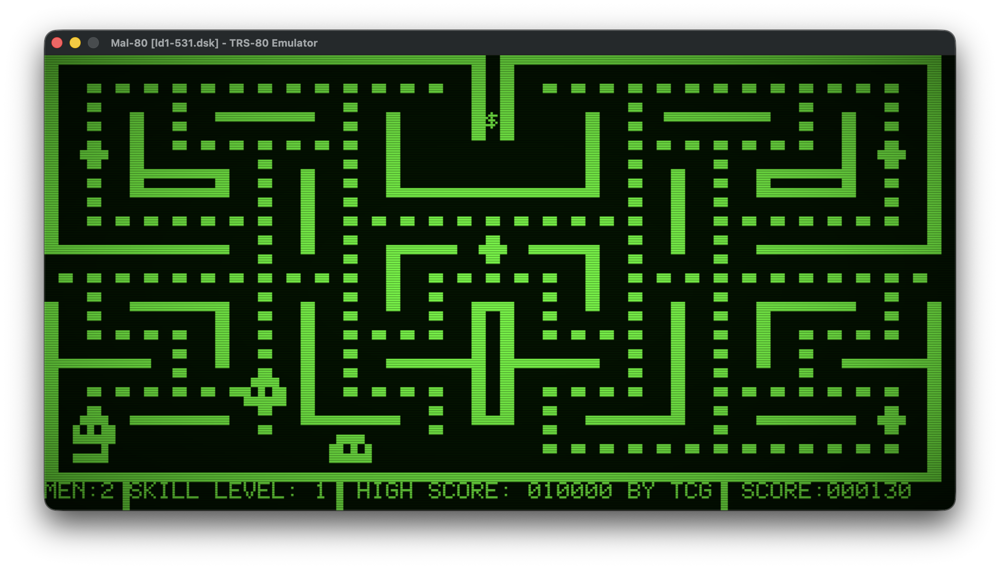

# Mal-80 — TRS-80 Model I Emulator

**Platform:** macOS M4 (arm64) | **Language:** C++20 | **Graphics:** SDL2

A TRS-80 Model I emulator with accurate Z80 emulation, cassette loading, and instant software injection.

---


*SCARFMAN (1981) running in Mal-80*

---

## Features

- **Z80 CPU** — passes all 67 ZEXALL tests
- **Instant software loading** — SYSTEM (.cas) and BASIC (.bas/.cas) files load very quickly via ROM intercepts, no FSK (frequency shift key - ie cassette tape noise) emulation wait
- **Turbo mode** — 100× speed during BASIC injection, automatic throttle back to 60 Hz for gameplay
- **1-bit audio** — port 0xFF square-wave output with IIR low-pass + DC-blocking filter via SDL audio
- **CLOAD / CSAVE** — full FSK cassette emulation for normal tape workflows and user boredom, sorry reminicing
- **`--load <name>`** — auto-load any software file from the command line
- **Freeze detector** — circular trace buffer auto-dumps `trace.log` if the emulator loops

---

## Quick Start

```bash
# Prerequisites
brew install sdl2

# Build
make

# Run (drops to BASIC READY prompt)
./mal-80

# Load a game directly
./mal-80 --load scarfman
```

---

## Build Targets

| Command | Description |
|---------|-------------|
| `make` | Build `./mal-80` |
| `make run` | Build and run |
| `make clean` | Remove build artefacts |
| `make zexall` | Run ZEXALL Z80 test suite (67/67) |

---

## Directory Structure

```
mal-80/
├── Makefile
├── roms/
│   └── level2.rom          TRS-80 Level II BASIC ROM (not committed — provide your own)
├── software/               .cas and .bas game/program files
├── docs/                   Screenshots and documentation images
└── src/
    ├── main.cpp            Entry point (~22 lines)
    ├── Emulator.hpp/cpp    Main loop, frame pacing, IM1 interrupt delivery
    ├── SoftwareLoader.hpp/cpp  File loading, ROM intercepts (SYSTEM/CLOAD/CSAVE)
    ├── KeyInjector.hpp/cpp Keyboard injection queue + $KEY intercept
    ├── Debugger.hpp/cpp    Circular trace buffer + freeze detector
    ├── Sound.hpp/cpp       1-bit audio: IIR filters + SDL_QueueAudio
    ├── cpu/
    │   ├── z80.hpp         Z80 CPU declaration
    │   └── z80.cpp         All opcodes (~1800 LOC)
    ├── system/
    │   ├── Bus.hpp         Memory map, cassette state
    │   └── Bus.cpp         Memory R/W, FSK cassette playback/recording
    └── video/
        ├── Display.hpp     SDL display constants
        ├── Display.cpp     SDL rendering, keyboard matrix, character ROM
        └── CharRom.hpp     TRS-80 MCM6670P character generator data
```

---

## Memory Map

| Address | Size | Description |
|---------|------|-------------|
| `0x0000–0x2FFF` | 12 KB | ROM (Level II BASIC) |
| `0x3800–0x3BFF` | 1 KB | Keyboard matrix (memory-mapped, active-low) |
| `0x3C00–0x3FFF` | 1 KB | Video RAM (64×16 characters) |
| `0x4000–0xFFFF` | 48 KB | User RAM |

---

## How Software Loading Works

Rather than waiting for real FSK tape timing, Mal-80 intercepts the ROM cassette
entry points and loads files instantly:

| ROM address | Intercept | Action |
|-------------|-----------|--------|
| `0x02CE` LOPHD | SYSTEM entry | Parse `.cas` binary, write blocks to RAM, jump to exec address |
| `0x0293` CSRDON | CLOAD entry | Stream FSK playback (`.cas`) or inject keystrokes (`.bas`) |
| `0x0284` | CSAVE entry | Record typed program back to `.cas` |
| `0x0049` $KEY | Keypress wait | Drain injection queue one char at a time |

File matching is case-insensitive prefix — `--load sc` matches `SCARFMAN.cas`.
If both `.bas` and `.cas` exist for the same name, `.bas` takes priority.

---

## Display

- 64×16 character display, each cell 6×12 pixels → 384×192 logical resolution
- Rendered at 3× scale: 1152×576 window
- ~60 Hz frame rate (29,498 T-states/frame)
- Title bar shows cassette status and `[TURBO]` when injection is active

---

## ROM

You must supply your own `roms/level2.rom` (12,288 bytes). TRS-80 ROMs are
copyrighted.

---

## Legal

ROMs are not included. `roms/` is in `.gitignore`.
Software in `software/` is freeware or shareware from the TRS-80 homebrew community.
